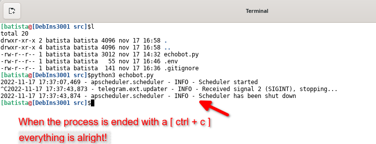

# Let's study and tests the first example: echobot.py
### Follow the Link on github: [`echobot.py`](https://github.com/python-telegram-bot/python-telegram-bot/blob/v13.x/examples/echobot.py) 
This is probably the base for most of the bots made with `python-telegram-bot`. It simply replies to each text message with a message that contains the same text.

### Let's study the code:

Starting at the beginning of the file, when the comments start...
### From lines, 6 to 16...
```
"""
Simple Bot to reply to Telegram messages.

First, a few handler functions are defined. Then, those functions are passed to
the Dispatcher and registered at their respective places.
Then, the bot is started and runs until we press Ctrl-C on the command line.

Usage:
Basic Echobot example, repeats messages.
Press Ctrl-C on the command line or send a signal to the process to stop the
bot.
"""
```
In the comment above it says that the bot acts like a telegram chat...
Also, it is in an endless loop waiting for a command. Which are defined by functions `[start. help, echo]`.
It also says that we can stop it by pressing the keys on our keyboard, `[Ctrl + C]`, or even we can send the command from our operating system to terminate the running process.

### From lines, 17 to 21...
Start read libs import.
 + `[ import os]` - Just to allow to manipulate work folder. 

 + `[import logging ]` - Just to help us debug the application, through log messages.

 + `[from dotenv import load_dotenv]` - Used to read data from an .env file. We are doing this to keep our private data safe when working with github. In this way, we put our data inside this file. Next, we'll configure .gitignore to not push it to github.
     + In case we do not have it installed on our system. It is necessary to install. Following the example: `[pip install python-dotenv]`  

 + `[from telegram import Update, ForceReply]` - Load the 2 first class from the `(telegram)` lib.

    + `[class Update(TelegramObject)]` - This object represents an incoming update. Objects of this class are comparable in terms of equality. Two objects of this class are considered equal, if their update_id is equal.
   
    + `[class ForceReply(ReplyMarkup)]`- Upon receiving a message with this object, Telegram clients will display a reply interface to the user (act as if the user has selected the bot's message and tapped 'Reply'). This can be extremely useful if you want to create user-friendly step-by-step interfaces without having to sacrifice privacy mode. Objects of this class are comparable in terms of equality. Two objects of this class are considered equal, if their selective is equal.
   
+ `[from telegram.ext import Updater, CommandHandler, MessageHandler, Filters, CallbackContext]` - Load 5 more class from `(telegram.ext)` lib.
    + `[class Updater(Generic[CCT, UD, CD, BD])]` - This class, which employs the telegram.ext.Dispatcher, provides a frontend to telegram.Bot to the programmer, so they can focus on coding the bot. Its purpose is to receive the updates from Telegram and to deliver them to said dispatcher. It also runs in a separate thread, so the user can interact with the bot, for example on the command line. The dispatcher supports handlers for different kinds of data: Updates from Telegram, basic text commands and even arbitrary types. The updater can be started as a polling service or, for production, use a webhook to receive updates. This is achieved using the WebhookServer and WebhookHandler classes.
  
    + `[class CommandHandler(Handler[Update, CCT])]` - Handler class to handle Telegram commands.
       Commands are Telegram messages that start with /, optionally followed by an @ and the bot's name and/or some additional text. The handler will add a list to the CallbackContext named CallbackContext.args. It will contain a list of strings, which is the text following the command split on single or consecutive whitespace characters.
       By default the handler listens to messages as well as edited messages. To change this behavior use ~Filters.update.edited_message in the filter argument.
  
    + `[class MessageHandler(Handler[Update, CCT])]` - Handler class to handle telegram messages. They might contain text, media or status updates.

    + `[class Filters]` - Predefined filters for use as the filter argument of telegram.ext.MessageHandler.
    + `[class CallbackContext(Generic[UD, CD, BD])]` - This is a context object passed to the callback called by telegram.ext.Handler or by the telegram.ext.Dispatcher in an error handler added by telegram.ext.Dispatcher.add_error_handler or to the callback of a telegram.ext.Job.
  
### From line 24:
Calls the function responsible for reading parameters from the `[.env]` file. It will read our Token from there, and other parameters we can save there.

### From line 27:
`[TOKEN = os.getenv('TOKEN')]` - Get our previously loaded `TOKEN` and set it to variable `[TOKEN]`, to be used later.

### From lines, 30 to 34:
Enable the loggin, and calls the function responsible for monitoring our application and sending warning messages for us.

```` python
# Enable logging
logging.basicConfig(
    format='%(asctime)s - %(name)s - %(levelname)s - %(message)s', level=logging.INFO
)

logger = logging.getLogger(__name__)
````
### From lines, 38 to 44:
Define the first function to interact with Telegram, `function[start]`.

```` python
def start(update: Update, context: CallbackContext) -> None:
    """Send a message when the command /start is issued."""
    user = update.effective_user
    update.message.reply_markdown_v2(
        fr'Hi {user.mention_markdown_v2()}\!',
        reply_markup=ForceReply(selective=True),
    )
````
### From lines, 47 to 49:
Define the second interaction function, `function[help_command]`

```` python
def help_command(update: Update, context: CallbackContext) -> None:
    """Send a message when the command /help is issued."""
    update.message.reply_text('Help!')
````
### From lines, 53 to 55:
Define third interaction function, `function[echo]`

```` python
def echo(update: Update, context: CallbackContext) -> None:
    """Echo the user message."""
    update.message.reply_text(update.message.text)
````
### From lines, 57 to 81:
Defines the sixth and last function, `function[main]`, and calls the controller to manage the trading process with telegram, and manages the generated events.

```` python
def main() -> None:
    """Start the bot."""
    # Create the Updater and pass it your bot's token.
    updater = Updater(TOKEN)

    # Get the dispatcher to register handlers
    dispatcher = updater.dispatcher

    # on different commands - answer in Telegram
    dispatcher.add_handler(CommandHandler("start", start))
    dispatcher.add_handler(CommandHandler("help", help_command))

    # on non command i.e message - echo the message on Telegram
    dispatcher.add_handler(MessageHandler(Filters.text & ~Filters.command, echo))

    # Start the Bot
    updater.start_polling()

    # Run the bot until you press Ctrl-C or the process receives SIGINT,
    # SIGTERM or SIGABRT. This should be used most of the time, since
    # start_polling() is non-blocking and will stop the bot gracefully.
    updater.idle()

if __name__ == '__main__':
    main()

````
### Finished all process. 
Now it's time to test.

### Testing...
For the test, we need to be in `[src]` folder.


The next step, is to see the application running, like in this image.


The next step, is to find our bot on telegram. like in this image.


The next step, is ckick in start bot, and ckick in event `[/start]`, like in this image.


The next step, is testing event with echo() function. like in this image.


The next step, is to discover that when an event does not exist, it will be answered with the echo() function, as in this image.


The next step, is to end the application from the command line like in this image...



### Now it's over... 
It's time for everyone to improve on this little example.
And create your applications more easily by studying the api.

### Good look...


 
