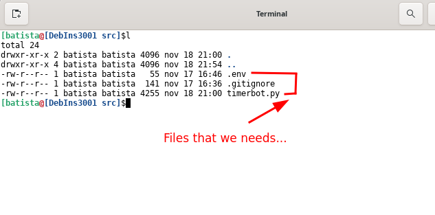
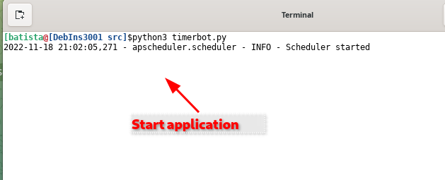
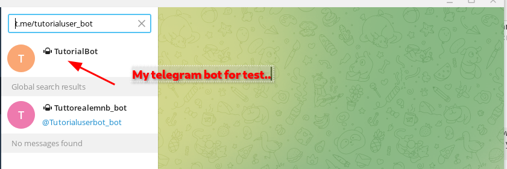
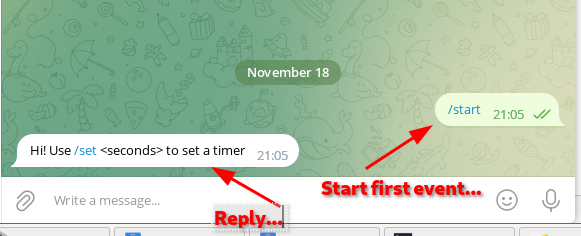
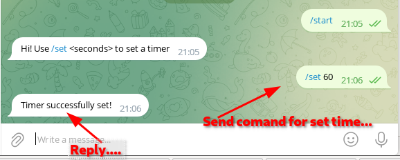
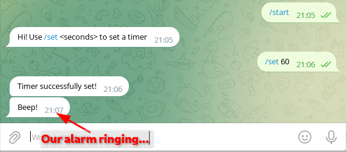
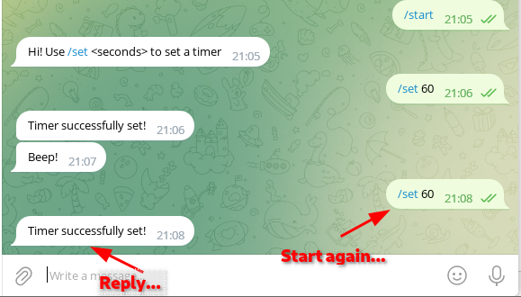
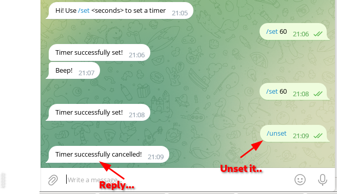
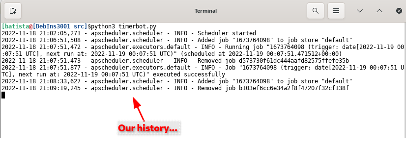
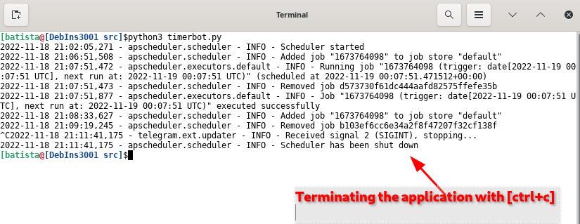

# Let's study and tests the second example: timerbot.py
### Follow the Link on github: [`timerbot.py`](https://github.com/python-telegram-bot/python-telegram-bot/blob/v13.x/examples/timerbot.py) 
This bot uses the [`JobQueue`](https://python-telegram-bot.readthedocs.io/en/latest/telegram.ext.jobqueue.html) class to send timed messages. The user sets a timer by using `/set` command with a specific time, for example `/set 30`. The bot then sets up a job to send a message to that user after 30 seconds. The user can also cancel the timer by sending `/unset`. To learn more about the `JobQueue`, read [this wiki article](https://github.com/python-telegram-bot/python-telegram-bot/wiki/Extensions-%E2%80%93-JobQueue).

### From lines, 5 to 19:
```` python
"""
Simple Bot to send timed Telegram messages.

This Bot uses the Updater class to handle the bot and the JobQueue to send
timed messages.

First, a few handler functions are defined. Then, those functions are passed to
the Dispatcher and registered at their respective places.
Then, the bot is started and runs until we press Ctrl-C on the command line.

Usage:
Basic Alarm Bot example, sends a message after a set time.
Press Ctrl-C on the command line or send a signal to the process to stop the
bot.
"""
````
The commentary explains about what the application does. Runs an infinite loop monitoring the tasks and events defined for a certain time. Until someone terminates the application by pressing `[ctrl+c]`, or even sends a command to end the process. 

### From lines, 20 to 24:

```` python
import os         # Iport used to  manipulate paths.
import logging    # To display warning messages. just to help debug the app.
from dotenv import load_dotenv   #To allow read paramns from .env file. To install: pip install python-dotenv
from telegram import Update
from telegram.ext import Updater, CommandHandler, CallbackContext
````
Description on comment...
+ `[import os]`, to work with path..
+ `[import logging]`, to work with warning message to debug application.
+ `[import load_dotenv]`, import function load_dotenv(), from lib. To read our TOKEN param from .env file.
+ `[import telegram import Update]`,  - Load the first class from the `(telegram)` lib.

    + `[class Update(TelegramObject)]` - This object represents an incoming update. Objects of this class are comparable in terms of equality. Two objects of this class are considered equal, if their update_id is equal.
   
+ `[from telegram.ext import Updater, CommandHandler, CallbackContext]` - Load 5 more class from `(telegram.ext)` lib.
    + `[class Updater(Generic[CCT, UD, CD, BD])]` - This class, which employs the telegram.ext.Dispatcher, provides a frontend to telegram.Bot to the programmer, so they can focus on coding the bot. Its purpose is to receive the updates from Telegram and to deliver them to said dispatcher. It also runs in a separate thread, so the user can interact with the bot, for example on the command line. The dispatcher supports handlers for different kinds of data: Updates from Telegram, basic text commands and even arbitrary types. The updater can be started as a polling service or, for production, use a webhook to receive updates. This is achieved using the WebhookServer and WebhookHandler classes.
  
    + `[class CommandHandler(Handler[Update, CCT])]` - Handler class to handle Telegram commands.
       Commands are Telegram messages that start with /, optionally followed by an @ and the bot's name and/or some additional text. The handler will add a list to the CallbackContext named CallbackContext.args. It will contain a list of strings, which is the text following the command split on single or consecutive whitespace characters.
       By default the handler listens to messages as well as edited messages. To change this behavior use ~Filters.update.edited_message in the filter argument.
  
    + `[class CallbackContext(Generic[UD, CD, BD])]` - This is a context object passed to the callback called by telegram.ext.Handler or by the telegram.ext.Dispatcher in an error handler added by telegram.ext.Dispatcher.add_error_handler or to the callback of a telegram.ext.Job.

### From line 27:
Calls the function responsible for reading parameters from the `[.env]` file. It will read our Token from there, and other parameters we can save there.

### From line 30:
`[TOKEN = os.getenv('TOKEN')]` - Get our previously loaded `TOKEN` and set it to variable `[TOKEN]`, to be used later.

From lines 33 to 36:
Enable the loggin, and calls the function responsible for monitoring our application and sending warning messages for us.

```` python
# Enable logging
logging.basicConfig(
    format='%(asctime)s - %(name)s - %(levelname)s - %(message)s', level=logging.INFO
)

logger = logging.getLogger(__name__)
````

### From lines, 44 to 46:
Define the first function to interact with Telegram, `function[start]`.

```` python
# Define a few command handlers. These usually take the two arguments update and
# context. Error handlers also receive the raised TelegramError object in error.
# Best practice would be to replace context with an underscore,
# since context is an unused local variable.
# This being an example and not having context present confusing beginners,
# we decided to have it present as context.
def start(update: Update, context: CallbackContext) -> None:
    """Sends explanation on how to use the bot."""
    update.message.reply_text('Hi! Use /set <seconds> to set a timer')
````
### From lines, 49 to 52:
Define the second function to interact with Telegram, `function[alarm]`

```` python
def alarm(context: CallbackContext) -> None:
    """Send the alarm message."""
    job = context.job
    context.bot.send_message(job.context, text='Beep!')
````

### From lines, 55 to 62:
Define the third interaction function, `function[remove_job_if_exists]`

```` python
def remove_job_if_exists(name: str, context: CallbackContext) -> bool:
    """Remove job with given name. Returns whether job was removed."""
    current_jobs = context.job_queue.get_jobs_by_name(name)
    if not current_jobs:
        return False
    for job in current_jobs:
        job.schedule_removal()
    return True
````
### From lines, 65 to 84:
Define the fouth interaction function, `function[set_timer]`. Function responsible to set event of timer to queue.

```` python
def set_timer(update: Update, context: CallbackContext) -> None:
    """Add a job to the queue."""
    chat_id = update.message.chat_id
    try:
        # args[0] should contain the time for the timer in seconds
        due = int(context.args[0])
        if due < 0:
            update.message.reply_text('Sorry we can not go back to future!')
            return

        job_removed = remove_job_if_exists(str(chat_id), context)
        context.job_queue.run_once(alarm, due, context=chat_id, name=str(chat_id))

        text = 'Timer successfully set!'
        if job_removed:
            text += ' Old one was removed.'
        update.message.reply_text(text)

    except (IndexError, ValueError):
        update.message.reply_text('Usage: /set <seconds>')
````

### From lines, 87 to 92:
Define the fifth interaction function, `function[unset]`. Remove a previously defined event.

```` python
def unset(update: Update, context: CallbackContext) -> None:
    """Remove the job if the user changed their mind."""
    chat_id = update.message.chat_id
    job_removed = remove_job_if_exists(str(chat_id), context)
    text = 'Timer successfully cancelled!' if job_removed else 'You have no active timer.'
    update.message.reply_text(text)
```` 
### From lines, 95 to 119:
Define the sixth and final function. The `main` function, where everything will happen, and all events will be monitored.

```` python
def main() -> None:
    """Run bot."""
    # Create the Updater and pass it your bot's token.
    updater = Updater("TOKEN")

    # Get the dispatcher to register handlers
    dispatcher = updater.dispatcher

    # on different commands - answer in Telegram
    dispatcher.add_handler(CommandHandler("start", start))
    dispatcher.add_handler(CommandHandler("help", start))
    dispatcher.add_handler(CommandHandler("set", set_timer))
    dispatcher.add_handler(CommandHandler("unset", unset))

    # Start the Bot
    updater.start_polling()

    # Block until you press Ctrl-C or the process receives SIGINT, SIGTERM or
    # SIGABRT. This should be used most of the time, since start_polling() is
    # non-blocking and will stop the bot gracefully.
    updater.idle()


if __name__ == '__main__':
    main()

````

### End of explanation. It's time to test everything...

### Testing...
For the test, we need to be in `[src]` folder.



The next step, is to see the application running, like in this image.



The next step, is to find our bot on telegram, like in this image.



The next step, is ckick in start bot.


The next step, is ckick in event `[/start]`, and see the help message, like in this image.



The next step, is set our alarm for test, like in this image.



The next step, is see our alarm riging, like in this image.



The next step, is set a new alarm to be canceled, like in this image..



The next step, is cancelling our alarm, like in this image.



The next step, is to view the history of our process test, like in this image.



The next step, is shutdown our application with `[ctrl+c]`, like in this image.



### Now it's over... 
It's time for everyone to improve on this little example.
And create your applications more easily by studying the api.

### Good look...